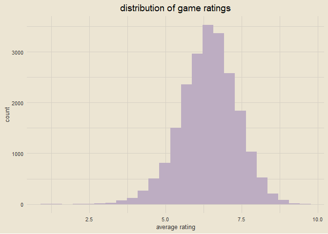
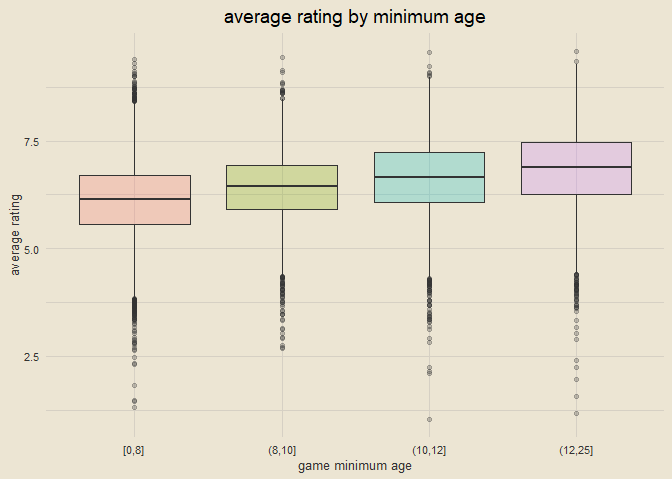
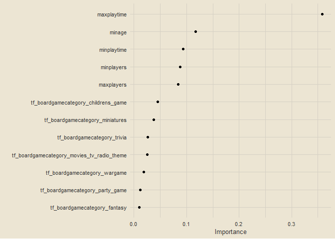
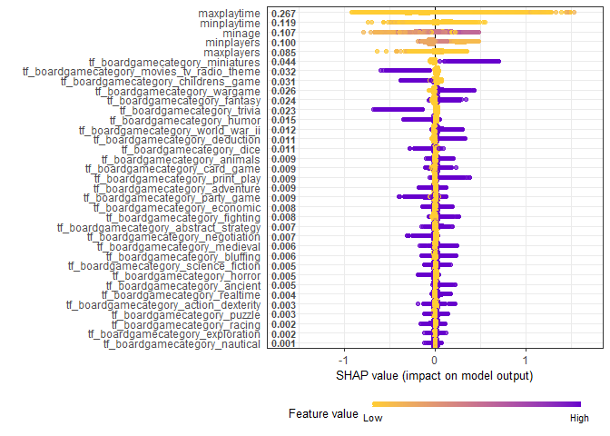

feature engineering & interpretability for xgboost with board game
ratings
================

------------------------------------------------------------------------

### setup

``` r
library(tidyverse)
library(tidymodels)
library(textrecipes)
library(finetune)
library(vip)
library(SHAPforxgboost)

theme_custom = tvthemes::theme_avatar() +
  theme(plot.title = element_text(hjust = 0.5),
        panel.grid.major = element_line(linewidth = 0.5, colour = "#D6D0C4"),
        panel.grid.minor = element_line(linewidth = 0.5, colour = "#D6D0C4"))

theme_set(theme_custom)
```

------------------------------------------------------------------------

### importing data

``` r
link = "https://raw.githubusercontent.com/rfordatascience/tidytuesday/master/data/2022/2022-01-25/ratings.csv"
ratings = read_csv(link, col_types = cols())
link = "https://raw.githubusercontent.com/rfordatascience/tidytuesday/master/data/2022/2022-01-25/details.csv"
details = read_csv(link, col_types = cols())

ratings_joined = ratings |>
  left_join(details, by = "id")

glimpse(ratings_joined)
```

    ## Rows: 21,831
    ## Columns: 32
    ## $ num.x                   <dbl> 105, 189, 428, 72, 103, 191, 100, 3, 15, 35, 3~
    ## $ id                      <dbl> 30549, 822, 13, 68448, 36218, 9209, 178900, 16~
    ## $ name                    <chr> "Pandemic", "Carcassonne", "Catan", "7 Wonders~
    ## $ year                    <dbl> 2008, 2000, 1995, 2010, 2008, 2004, 2015, 2016~
    ## $ rank                    <dbl> 106, 190, 429, 73, 104, 192, 101, 4, 16, 36, 3~
    ## $ average                 <dbl> 7.59, 7.42, 7.14, 7.74, 7.61, 7.41, 7.60, 8.42~
    ## $ bayes_average           <dbl> 7.487, 7.309, 6.970, 7.634, 7.499, 7.305, 7.50~
    ## $ users_rated             <dbl> 108975, 108738, 108024, 89982, 81561, 76171, 7~
    ## $ url                     <chr> "/boardgame/30549/pandemic", "/boardgame/822/c~
    ## $ thumbnail               <chr> "https://cf.geekdo-images.com/S3ybV1LAp-8SnHIX~
    ## $ num.y                   <dbl> 0, 1, 2, 3, 4, 5, 6, 7, 8, 9, 10, 11, 12, 13, ~
    ## $ primary                 <chr> "Pandemic", "Carcassonne", "Catan", "7 Wonders~
    ## $ description             <chr> "In Pandemic, several virulent diseases have b~
    ## $ yearpublished           <dbl> 2008, 2000, 1995, 2010, 2008, 2004, 2015, 2016~
    ## $ minplayers              <dbl> 2, 2, 3, 2, 2, 2, 2, 1, 2, 1, 3, 2, 1, 2, 2, 2~
    ## $ maxplayers              <dbl> 4, 5, 4, 7, 4, 5, 8, 5, 2, 5, 5, 4, 5, 5, 5, 4~
    ## $ playingtime             <dbl> 45, 45, 120, 30, 30, 60, 15, 120, 30, 150, 150~
    ## $ minplaytime             <dbl> 45, 30, 60, 30, 30, 30, 15, 120, 30, 30, 90, 3~
    ## $ maxplaytime             <dbl> 45, 45, 120, 30, 30, 60, 15, 120, 30, 150, 150~
    ## $ minage                  <dbl> 8, 7, 10, 10, 13, 8, 14, 12, 10, 12, 12, 10, 1~
    ## $ boardgamecategory       <chr> "['Medical']", "['City Building', 'Medieval', ~
    ## $ boardgamemechanic       <chr> "['Action Points', 'Cooperative Game', 'Hand M~
    ## $ boardgamefamily         <chr> "['Components: Map (Global Scale)', 'Component~
    ## $ boardgameexpansion      <chr> "['Pandemic: Gen Con 2016 Promos – Z-Force Tea~
    ## $ boardgameimplementation <chr> "['Pandemic Legacy: Season 0', 'Pandemic Legac~
    ## $ boardgamedesigner       <chr> "['Matt Leacock']", "['Klaus-Jürgen Wrede']", ~
    ## $ boardgameartist         <chr> "['Josh Cappel', 'Christian Hanisch', 'Régis M~
    ## $ boardgamepublisher      <chr> "['Z-Man Games', 'Albi', 'Asmodee', 'Asmodee I~
    ## $ owned                   <dbl> 168364, 161299, 167733, 120466, 106956, 105748~
    ## $ trading                 <dbl> 2508, 1716, 2018, 1567, 2009, 930, 1110, 538, ~
    ## $ wanting                 <dbl> 625, 582, 485, 1010, 655, 692, 340, 2011, 924,~
    ## $ wishing                 <dbl> 9344, 7383, 5890, 12105, 8621, 6620, 5764, 192~

------------------------------------------------------------------------

### visualizing rating distribution

``` r
ratings_joined |>
  ggplot(aes(average)) +
  geom_histogram(bins = 25, fill = "#BDADC2") +
  labs(x = "average rating", title = "distribution of game ratings")
```

<!-- -->

------------------------------------------------------------------------

### boxplots of average game ratings by minimum age

``` r
ratings_joined |>
  filter(!is.na(minage)) |>
  mutate(minage = cut_number(minage, 4)) |>
  ggplot(aes(minage, average)) +
  geom_boxplot(aes(fill = minage), alpha = 0.25, show.legend = F) +
  labs(x = "game minimum age", y = "average rating",
       title = "average rating by minimum age")
```

<!-- -->

------------------------------------------------------------------------

### preparing data for modeling

``` r
set.seed(123)

game_split = ratings_joined |>
  select(name, average, matches("min|max"), boardgamecategory) |>
  na.omit() |>
  initial_split(strata = average)

game_train = training(game_split)
game_test = testing(game_split)
set.seed(234)
game_folds = vfold_cv(game_train, strata = average)
game_folds
```

    ## #  10-fold cross-validation using stratification 
    ## # A tibble: 10 x 2
    ##    splits               id    
    ##    <list>               <chr> 
    ##  1 <split [14407/1602]> Fold01
    ##  2 <split [14407/1602]> Fold02
    ##  3 <split [14407/1602]> Fold03
    ##  4 <split [14408/1601]> Fold04
    ##  5 <split [14408/1601]> Fold05
    ##  6 <split [14408/1601]> Fold06
    ##  7 <split [14408/1601]> Fold07
    ##  8 <split [14408/1601]> Fold08
    ##  9 <split [14410/1599]> Fold09
    ## 10 <split [14410/1599]> Fold10

------------------------------------------------------------------------

### creating custom tokenization function

``` r
split_category = function(x) {
  x |>
    str_split(", ") |>
    map(str_remove_all, "[:punct:]") |>
    map(str_squish) |>
    map(str_to_lower) |>
    map(str_replace_all, " ", "_")
}

game_rec = recipe(average ~ ., data = game_train) |>
  update_role(name, new_role = "id") |>
  step_tokenize(boardgamecategory, custom_token = split_category) |>
  step_tokenfilter(boardgamecategory, max_tokens = 30) |>
  step_tf(boardgamecategory)

game_prep = prep(game_rec)
bake(game_prep, new_data = NULL) |> str()
```

    ## tibble [16,009 x 37] (S3: tbl_df/tbl/data.frame)
    ##  $ name                                      : Factor w/ 15781 levels "'65: Squad-Level Combat in the Jungles of Vietnam",..: 10875 8605 14660 876 15746 6837 13331 1508 3161 9951 ...
    ##  $ minplayers                                : num [1:16009] 2 2 2 4 2 1 2 2 4 2 ...
    ##  $ maxplayers                                : num [1:16009] 6 8 10 10 6 8 6 2 16 6 ...
    ##  $ minplaytime                               : num [1:16009] 120 60 30 30 60 20 60 30 60 45 ...
    ##  $ maxplaytime                               : num [1:16009] 120 180 30 30 90 20 60 30 60 45 ...
    ##  $ minage                                    : num [1:16009] 10 8 6 12 15 6 8 8 13 8 ...
    ##  $ average                                   : num [1:16009] 5.59 4.37 5.41 5.79 5.8 5.62 4.31 4.66 5.68 5.14 ...
    ##  $ tf_boardgamecategory_abstract_strategy    : num [1:16009] 0 0 0 0 0 0 0 0 0 0 ...
    ##  $ tf_boardgamecategory_action_dexterity     : num [1:16009] 0 0 0 0 0 1 0 0 0 0 ...
    ##  $ tf_boardgamecategory_adventure            : num [1:16009] 0 0 0 0 0 0 0 0 0 0 ...
    ##  $ tf_boardgamecategory_ancient              : num [1:16009] 0 0 0 0 0 0 0 0 0 0 ...
    ##  $ tf_boardgamecategory_animals              : num [1:16009] 0 0 0 0 0 0 0 0 0 0 ...
    ##  $ tf_boardgamecategory_bluffing             : num [1:16009] 0 0 0 0 0 0 0 0 0 0 ...
    ##  $ tf_boardgamecategory_card_game            : num [1:16009] 0 0 1 1 0 0 0 0 0 1 ...
    ##  $ tf_boardgamecategory_childrens_game       : num [1:16009] 0 0 0 0 0 0 1 1 0 0 ...
    ##  $ tf_boardgamecategory_deduction            : num [1:16009] 0 0 0 0 0 0 0 1 0 0 ...
    ##  $ tf_boardgamecategory_dice                 : num [1:16009] 0 0 0 0 0 0 0 0 0 0 ...
    ##  $ tf_boardgamecategory_economic             : num [1:16009] 0 1 0 0 0 0 1 0 0 0 ...
    ##  $ tf_boardgamecategory_exploration          : num [1:16009] 0 0 0 0 1 0 0 0 0 0 ...
    ##  $ tf_boardgamecategory_fantasy              : num [1:16009] 0 0 0 0 0 0 0 0 0 0 ...
    ##  $ tf_boardgamecategory_fighting             : num [1:16009] 0 0 0 0 1 0 0 0 0 0 ...
    ##  $ tf_boardgamecategory_horror               : num [1:16009] 0 0 0 0 1 0 0 0 0 0 ...
    ##  $ tf_boardgamecategory_humor                : num [1:16009] 0 0 0 1 0 0 0 0 0 0 ...
    ##  $ tf_boardgamecategory_medieval             : num [1:16009] 0 0 0 0 0 0 0 0 0 0 ...
    ##  $ tf_boardgamecategory_miniatures           : num [1:16009] 0 0 0 0 1 0 0 0 0 0 ...
    ##  $ tf_boardgamecategory_movies_tv_radio_theme: num [1:16009] 0 0 1 0 1 0 0 0 0 0 ...
    ##  $ tf_boardgamecategory_nautical             : num [1:16009] 0 0 0 0 0 0 0 1 0 0 ...
    ##  $ tf_boardgamecategory_negotiation          : num [1:16009] 0 1 0 0 0 0 0 0 0 0 ...
    ##  $ tf_boardgamecategory_party_game           : num [1:16009] 0 0 0 1 0 1 0 0 1 0 ...
    ##  $ tf_boardgamecategory_print_play           : num [1:16009] 0 0 0 0 0 0 0 0 0 0 ...
    ##  $ tf_boardgamecategory_puzzle               : num [1:16009] 0 0 0 0 0 0 0 0 1 0 ...
    ##  $ tf_boardgamecategory_racing               : num [1:16009] 0 0 0 0 0 0 0 0 0 0 ...
    ##  $ tf_boardgamecategory_realtime             : num [1:16009] 0 0 0 0 0 0 0 0 0 0 ...
    ##  $ tf_boardgamecategory_science_fiction      : num [1:16009] 0 0 0 0 0 0 0 0 0 0 ...
    ##  $ tf_boardgamecategory_trivia               : num [1:16009] 0 0 0 0 0 0 0 0 1 0 ...
    ##  $ tf_boardgamecategory_wargame              : num [1:16009] 1 0 0 0 0 0 0 1 0 0 ...
    ##  $ tf_boardgamecategory_world_war_ii         : num [1:16009] 0 0 0 0 0 0 0 0 0 0 ...

------------------------------------------------------------------------

### building tunable model specification

``` r
xgb_spec = boost_tree(trees = tune(), min_n = tune(), learn_rate = 0.01) |>
  set_engine("xgboost") |>
  set_mode("regression")

xgb_wf = workflow(game_rec, xgb_spec)
xgb_wf
```

    ## == Workflow ====================================================================
    ## Preprocessor: Recipe
    ## Model: boost_tree()
    ## 
    ## -- Preprocessor ----------------------------------------------------------------
    ## 3 Recipe Steps
    ## 
    ## * step_tokenize()
    ## * step_tokenfilter()
    ## * step_tf()
    ## 
    ## -- Model -----------------------------------------------------------------------
    ## Boosted Tree Model Specification (regression)
    ## 
    ## Main Arguments:
    ##   trees = tune()
    ##   min_n = tune()
    ##   learn_rate = 0.01
    ## 
    ## Computational engine: xgboost

------------------------------------------------------------------------

### tuning model

``` r
doParallel::registerDoParallel()
set.seed(345)

xgb_game_rs = tune_grid(xgb_wf, game_folds, grid = 10,
                        control = control_race(verbose_elim = T, pkgs = "stringr"))

xgb_game_rs
```

    ## # Tuning results
    ## # 10-fold cross-validation using stratification 
    ## # A tibble: 10 x 4
    ##    splits               id     .metrics          .notes          
    ##    <list>               <chr>  <list>            <list>          
    ##  1 <split [14407/1602]> Fold01 <tibble [14 x 6]> <tibble [3 x 1]>
    ##  2 <split [14407/1602]> Fold02 <tibble [20 x 6]> <tibble [0 x 1]>
    ##  3 <split [14407/1602]> Fold03 <tibble [20 x 6]> <tibble [0 x 1]>
    ##  4 <split [14408/1601]> Fold04 <tibble [20 x 6]> <tibble [0 x 1]>
    ##  5 <split [14408/1601]> Fold05 <tibble [20 x 6]> <tibble [0 x 1]>
    ##  6 <split [14408/1601]> Fold06 <tibble [20 x 6]> <tibble [0 x 1]>
    ##  7 <split [14408/1601]> Fold07 <tibble [20 x 6]> <tibble [0 x 1]>
    ##  8 <split [14408/1601]> Fold08 <tibble [20 x 6]> <tibble [0 x 1]>
    ##  9 <split [14410/1599]> Fold09 <tibble [20 x 6]> <tibble [0 x 1]>
    ## 10 <split [14410/1599]> Fold10 <tibble [20 x 6]> <tibble [0 x 1]>

------------------------------------------------------------------------

### getting best model specs

``` r
show_best(xgb_game_rs, metric = "rmse")
```

    ## # A tibble: 5 x 8
    ##   trees min_n .metric .estimator  mean     n std_err .config              
    ##   <int> <int> <chr>   <chr>      <dbl> <int>   <dbl> <chr>                
    ## 1  1897    17 rmse    standard   0.737    10 0.00545 Preprocessor1_Model05
    ## 2  1225    24 rmse    standard   0.737    10 0.00521 Preprocessor1_Model06
    ## 3  1465    16 rmse    standard   0.737    10 0.00553 Preprocessor1_Model04
    ## 4  1603    12 rmse    standard   0.738     9 0.00598 Preprocessor1_Model03
    ## 5  1056    39 rmse    standard   0.738    10 0.00524 Preprocessor1_Model10

------------------------------------------------------------------------

### selecting best model

``` r
xgb_last = xgb_wf |>
  finalize_workflow(select_best(xgb_game_rs, "rmse")) |>
  last_fit(game_split)

xgb_last
```

    ## # Resampling results
    ## # Manual resampling 
    ## # A tibble: 1 x 6
    ##   splits               id               .metrics .notes   .predicti~1 .workflow 
    ##   <list>               <chr>            <list>   <list>   <list>      <list>    
    ## 1 <split [16009/5339]> train/test split <tibble> <tibble> <tibble>    <workflow>
    ## # ... with abbreviated variable name 1: .predictions

------------------------------------------------------------------------

### getting variable importance

``` r
xgb_fit = extract_fit_parsnip(xgb_last)
vip(xgb_fit, geom = "point", num_features = 12)
```

<!-- -->

------------------------------------------------------------------------

### computing SHAP values

``` r
game_shap = shap.prep(xgb_model = extract_fit_engine(xgb_fit),
                      X_train = bake(game_prep, has_role("predictor"),
                                     new_data = NULL, composition = "matrix"))

shap.plot.summary(game_shap)
```

<!-- -->
